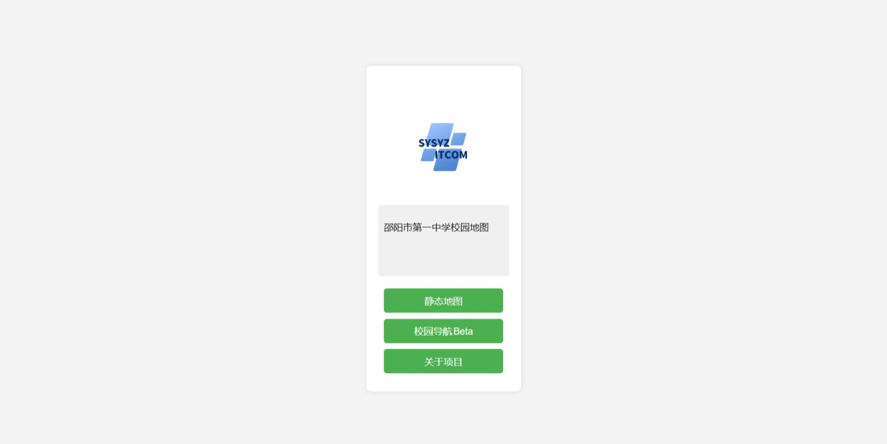
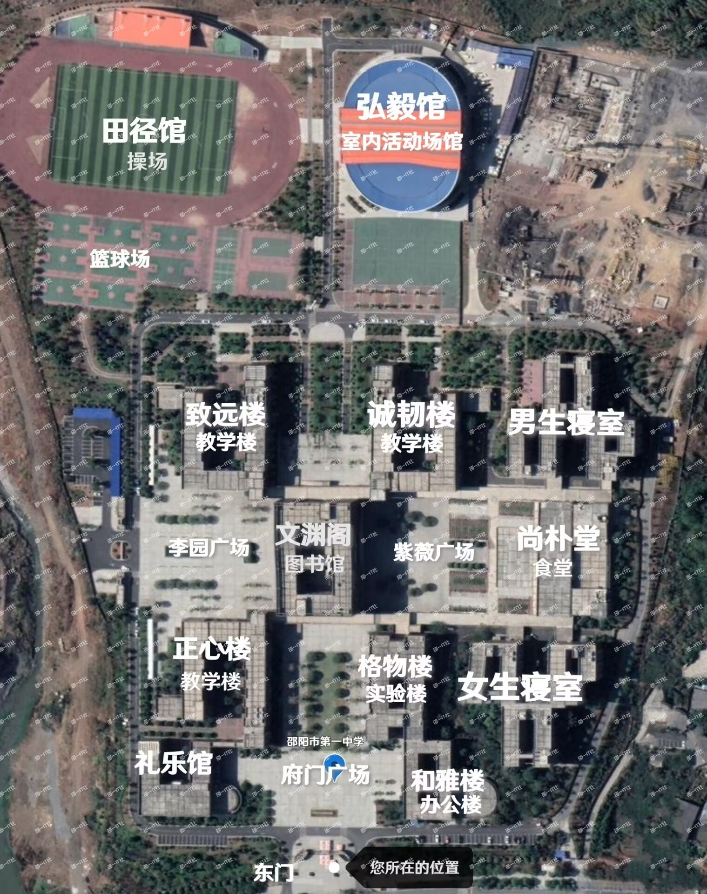
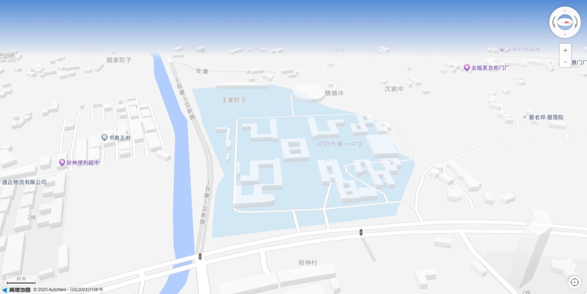

# 邵阳市第一中学可视化地图服务

> [!WARNING]
> 由于技术原因，项目正在进行维护，我们会尽快重新上线。

在线体验：[WEB](https://sourl.cn/PB3VVL)

## 项目介绍
为邵阳市第一中学构建的校园地图系统，预计提供一个标准地图和一个实时定位导航页面。在学校开放日时，来校参观的家长和学生可以通过此项目提供的页面快速定位，并且了解当前所在楼的介绍信息等。

> [!IMPORTANT]
> **邵阳市第一中学信息技术社团** 是非盈利性质的校园兴趣社团，没有能力提供高性能、高服务质量和高访问请求的能力，在您使用 **可视化定位导航** 时可能出现 **请求错误 或 请求超时** 的情况。如果您看到类似字样，请尝试使用 **静态地图**。
>
> **本项目仍在开发中，部分功能还未完善！**

## 页面速览

> [!NOTE]
> 仅提供页面描述说明，当前截图内容在 2025.01.26 被保存，后续内容可能有所更改。

### 首页

### 静态地图

### 机器人验证

### 动态地图【BETA】
> [!WARNING]
> 动态地图仍在测试中，您看到的页面不代表最终效果。

## 贡献人员列表
### 项目创建
- yizhixianyuuuu（NiePeiyu）
### 贡献列表
感谢以下同学对本项目的贡献，根据班级排名。

|姓名|班级|GitHub|
|:---:|:---:|:---:|
|LiJiajun|G2109（已毕业）|[Fuwaki](https://github.com/Fuwaki)|
|ZhuYunfeng|G2315|/|
|NiePeiyu|G2320|[yizhixianyuuuu](https://github.com/yizhixianyuuuu)|

## 第三方服务列表
|平台|服务内容|
|:---:|:---:|
|高德地图|实时地图 API|
|Cloudflare|Cloudflare Pages|
|Cloudflare|Cloudflare Trunstile|
|Github|Github Pages|

## 其它内容公示
> [!WARNING]
> 以下服务会在您使用时收集您的部分信息。
> 1. 高德地图 API ：在您使用实时地图时基于 GPS 收集您的定位信息。
> 2. 社团下载服务：在您尝试下载 **邵一地图** 应用程序时基于用户代理字符串判断您的设备系统。
> 3. 短链接服务：在您使用学校提供的二维码访问本项目提供的任意服务时，我们将收集您的设备信息，包括但不限于型号、系统、屏幕分辨率、浏览器内核版本等。
> 4. 人机验证：使用 Cloudflare Trunstile 对您的身份进行验证。
